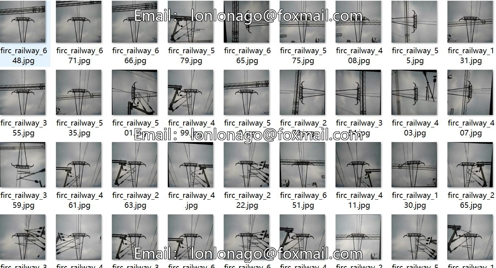
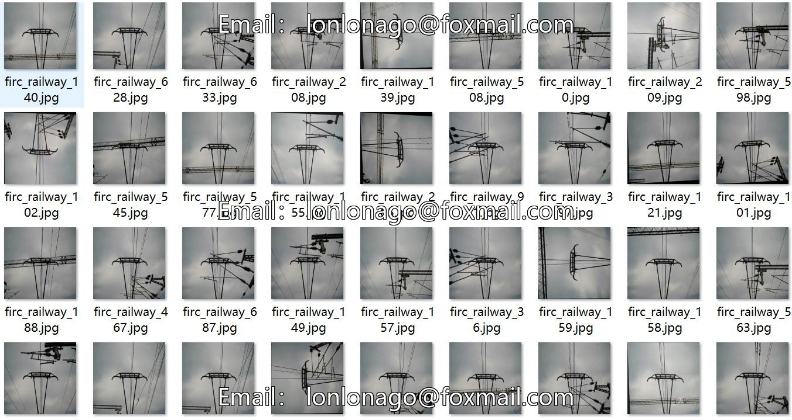
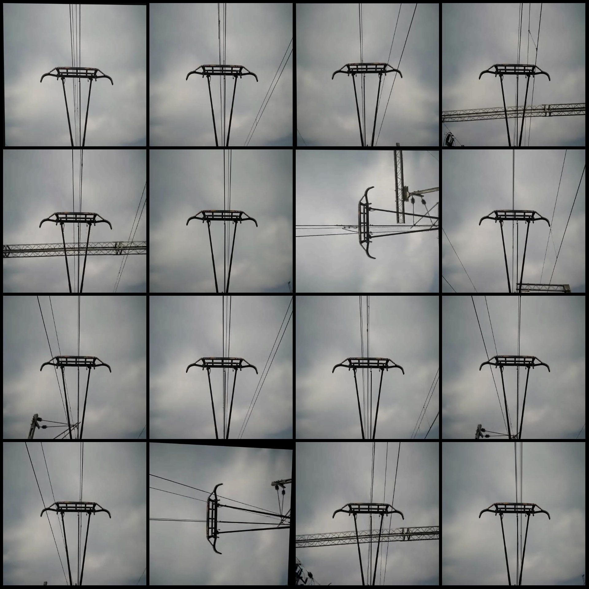
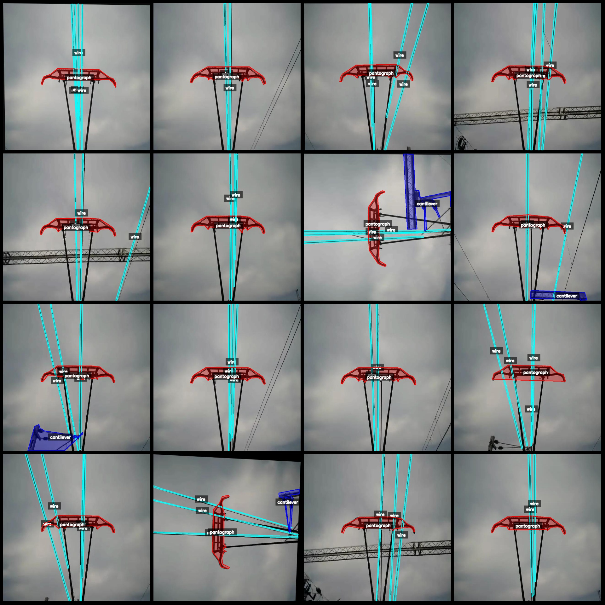
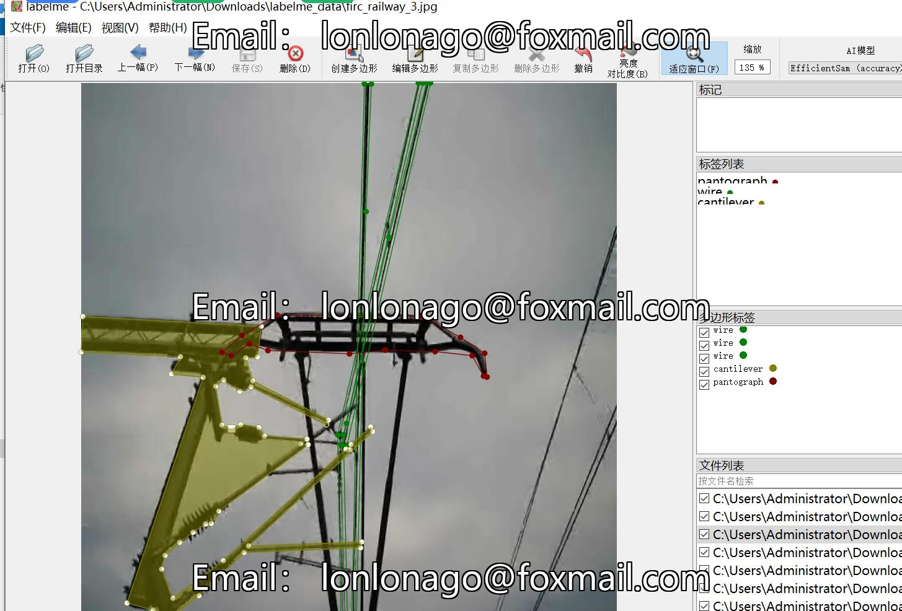

# Intelligent Railway High-Speed Train Electrodynamic Wire Arm Identification and Segmentation Data Set - LabelMe Format: 687 Images, 3 Categories

Dataset Format: LabelMe format (excluding mask files, only containing JPG images and corresponding JSON files).
Number of Images: 687
Number of Annotated Files: 687
Number of Annotated Categories: 3
Annotated Category Names: ["Pantograph", "Wire", "Cantilever"]
Number of Boxes for Each Category:
Pantograph (Electrodynamic Wire): count = 689
Wire (Conductor): count = 2145
Cantilever (Arm): count = 434
Total Boxes: 3268
Annotation Tool Used: labelme=5.5.0
Image Resolution: 640x640
Annotation Rules: Polygon is drawn around the category.
Important Notice: The dataset can be opened and edited using LabelMe, but JSON datasets need to be converted into either mask or Yolo format or COCO format for semantic segmentation or instance 
segmentation.
Special Remark: This dataset does not guarantee the accuracy of the models trained or the weights files.
Image Preview:
Example of Annotation:
Original Image:
Annotation Drawing Results:
LabelMe Editing Example:

## Images

Here is a pay link on Stripe ( https://buy.stripe.com/3cs8yP7sY87d0vu9AB ). Please contact me lonlonago@foxmail.com after funding $89, and I will send you a complete data files , thank you!

